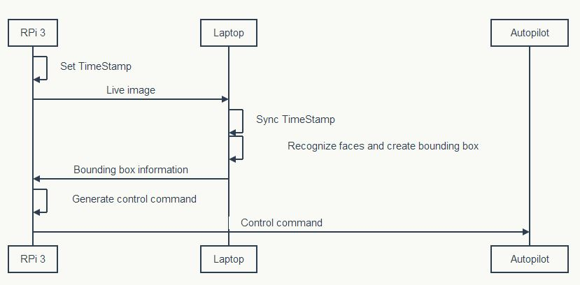
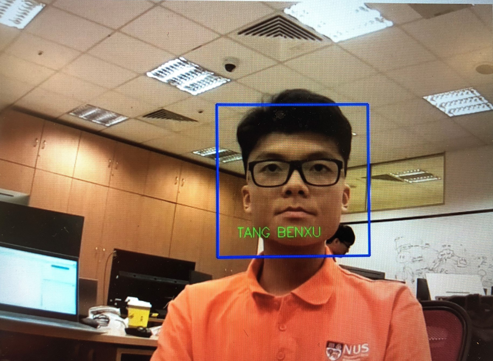
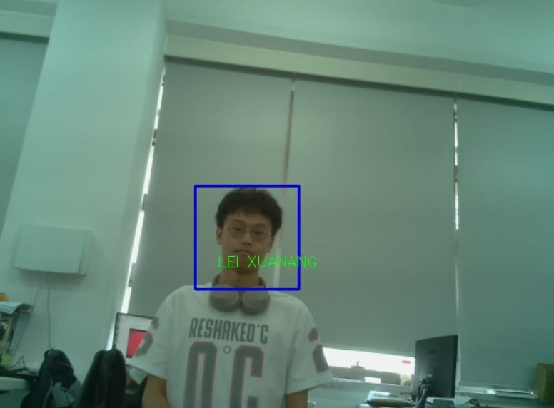
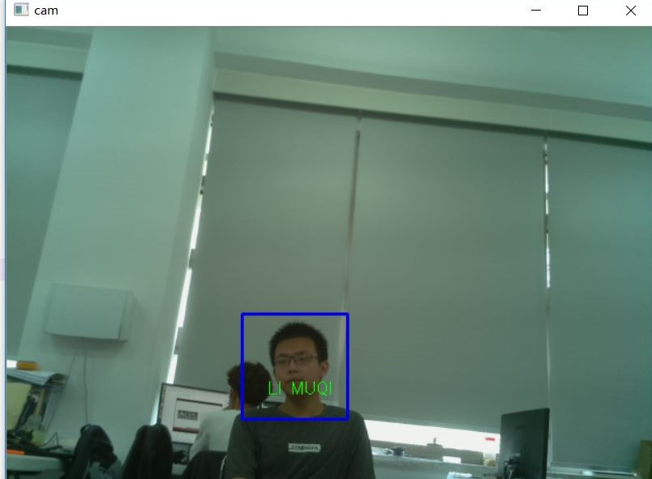

# UAV-follow-faces

Docs and Python scripts for UAVs to follow faces.

# 整体框架
## Objective
实现无人机对人脸的识别，"认出熟悉的人"，并跟踪特定的人脸

## 实现
由于Raspberry Pi 3的算力不足，无法胜任检测并识别人脸，获取人脸包围框这样复杂的任务。因此需要以笔记本电脑作为服务器，树莓派实时拍照并传送到远端笔记本电脑，处理完成后，将人脸及其包围框信息传回树莓派。

## 整体框架图

# 实现效果
提取人脸包围框，同时识别出我们几个团队成员，打印名字在屏幕
- 识别结果：唐本旭

- 识别结果：雷轩昂

- 识别结果：李慕琦

# History
[项目历史记录](./project_history)包含各阶段成果以及遇到的问题

# 文档
[文档](./docs)中包含项目进行过程中的经验笔记和排坑总结

# 源代码
[源代码](./scripts)均为Python脚本，包含

- 图像拍照及传输
- 人脸数据训练
- 人脸检测与识别
- offboard模式下的自动VTOL(Vertical Take-off and Landing)程序
- 树莓派GPIO控制舵机
